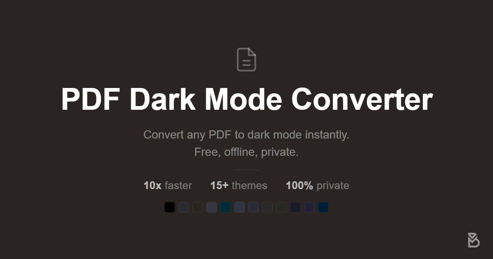
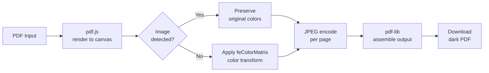

# PDF Dark Mode Converter

**Convert any PDF to dark mode — instantly, offline, and 100% in your browser.**

---

> [!IMPORTANT]
> **Your files never leave your device.** No uploads, no server, no sign-up. Everything runs client-side via Web APIs.

---

## Features

| | |
|---|---|
| **Up to 10× faster** | GPU-accelerated `feColorMatrix` color transforms with concurrent page processing |
| **16+ themes** | Classic · Dracula · Nord · Tokyo Night · Rosé Pine · Gruvbox · Solarized · Monokai · Cobalt · Sepia · Midnight Blue · Forest Green · Claude Warm · ChatGPT Cool · Slate — plus a custom color picker |
| **Selectable text** | Invisible text layer preserved — search, copy, and highlight all work in the output PDF |
| **Image preservation** | Detects embedded photos and graphics and keeps their original colors |
| **Batch conversion** | Drop multiple PDFs at once and process them all in one go |
| **Bidirectional** | Light-to-dark or dark-to-light — your choice |
| **Adjustable output** | Resolution (0.5×–4×) and JPEG quality (50–100%) |
| **Invert tool** | Separate [Invert PDF Colors](https://bratuka.dev/pdf-dark-mode-converter/invert-pdf-colors/) tool for true RGB complement inversion |

---

## Quick Start

1. Open **[bratuka.dev/pdf-dark-mode-converter](https://bratuka.dev/pdf-dark-mode-converter/)**
2. Drop one or more PDFs onto the page, or click **Choose PDF Files**
3. Pick a theme — the converted PDF downloads automatically when done

Settings (resolution, quality, selectable text, image preservation) are available via the **Settings** panel before conversion.

---

## How It Works

---

## Tech Stack

| Library | Version | Role |
|---------|---------|------|
| [pdf.js](https://mozilla.github.io/pdf.js/) | 2.16.105 | PDF parsing and canvas rendering |
| [pdf-lib](https://pdf-lib.js.org/) | 1.11.0 | Output PDF assembly |
| [jszip](https://stuk.github.io/jszip/) | 3.10.1 | Batch ZIP packaging |

No build system, no bundler, no dependencies to install. Vanilla HTML/CSS/JS, deployed as a static site on GitHub Pages.

---

## Languages

Available in 10 languages:
**English** · **Español** · **Français** · **Deutsch** · **Italiano** · **Português** · **中文** · **한국어** · **日本語** · **Русский**

---

<strong>Blog — 14 Guides</strong>

 

**By platform:**

| Platform | Guide |
|----------|-------|
| Chrome | [PDF Dark Mode in Chrome](https://bratuka.dev/pdf-dark-mode-converter/blog/chrome-pdf-dark-mode/) |
| Firefox | [PDF Dark Mode in Firefox](https://bratuka.dev/pdf-dark-mode-converter/blog/firefox-pdf-dark-mode/) |
| Edge | [PDF Dark Mode in Edge](https://bratuka.dev/pdf-dark-mode-converter/blog/pdf-dark-mode-microsoft-edge/) |
| Windows | [PDF Dark Mode on Windows](https://bratuka.dev/pdf-dark-mode-converter/blog/pdf-dark-mode-windows/) |
| iPhone | [PDF Dark Mode on iPhone](https://bratuka.dev/pdf-dark-mode-converter/blog/pdf-dark-mode-iphone/) |
| iPad | [PDF Dark Mode on iPad](https://bratuka.dev/pdf-dark-mode-converter/blog/pdf-dark-mode-ipad/) |
| Android | [PDF Dark Mode on Android](https://bratuka.dev/pdf-dark-mode-converter/blog/pdf-dark-mode-android/) |
| Adobe Acrobat | [Dark Mode in Acrobat](https://bratuka.dev/pdf-dark-mode-converter/blog/adobe-acrobat-pdf-dark-mode/) |
| Google Drive | [Dark Mode in Google Drive](https://bratuka.dev/pdf-dark-mode-converter/blog/pdf-dark-mode-google-drive/) |

**Concepts & how-tos:**

- [Dark Mode vs Invert Colors — what's the difference?](https://bratuka.dev/pdf-dark-mode-converter/blog/pdf-dark-mode-vs-invert-colors/)
- [How to Invert PDF Colors](https://bratuka.dev/pdf-dark-mode-converter/blog/invert-pdf-colors/)
- [Invert PDF for Printing](https://bratuka.dev/pdf-dark-mode-converter/blog/invert-pdf-for-printing/)
- [How to Read PDFs at Night](https://bratuka.dev/pdf-dark-mode-converter/blog/read-pdf-at-night/)
- [Convert PDF to Dark Mode Online](https://bratuka.dev/pdf-dark-mode-converter/blog/convert-pdf-to-dark-mode-online/)

---

## License & Attribution

Licensed under the [PolyForm Noncommercial License 1.0.0](LICENSE.md) — free for personal use, commercial use not permitted.

Originally created by [Chizkiyahu](https://github.com/Chizkiyahu/pdf-dark-mode-converter) (MIT, 2023). This fork adds GPU acceleration, 16+ themes, batch conversion, image preservation, selectable text, i18n, and more — maintained by [BrAtUkA](https://github.com/BrAtUkA).

 

